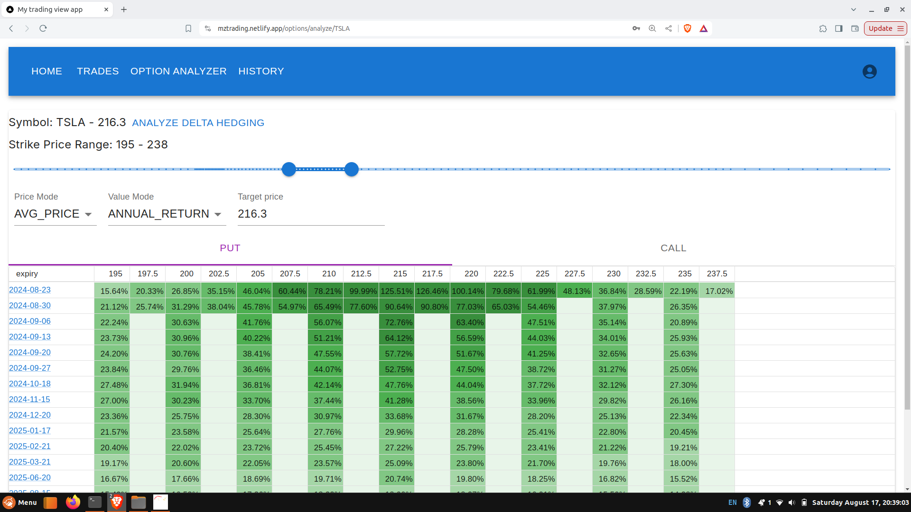
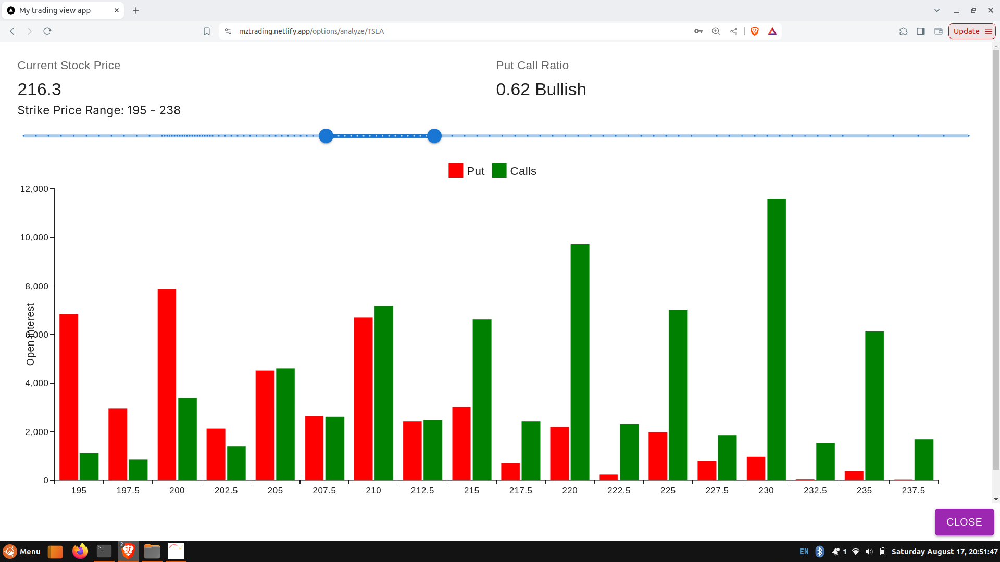
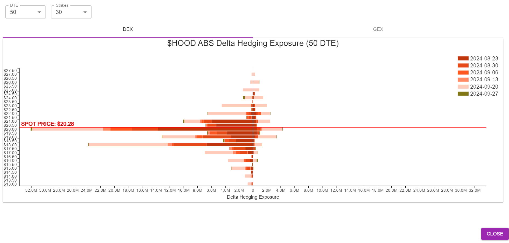
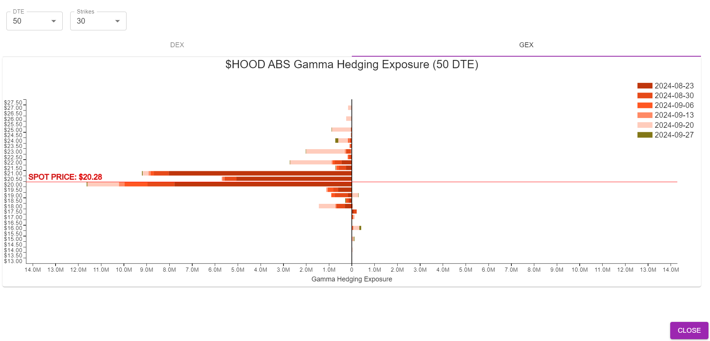

# MyTradingView

Welcome to the MyTradingView! This project is a Next.js application designed to help you analyze stock options efficiently. It offers a comprehensive set of features for exploring and making decisions about stock options.

## Features

- In-depth stock option analysis
- View the profit for any option symbol, including total and annual returns, to determine which option offers the best return.

- Put call ratio for any symbol

- Delta hedging exposure view for any symbol

- Gamma hedging exposure view for any symbol

- Integration with external trading APIs (tradier) for reading option data
- Responsive and intuitive user interface

## Prerequisites

Before you get started, ensure you have the following installed:

- Node.js (LTS version recommended)
- PostgreSQL database (free cloud instance is available through supabase)
- Prisma CLI

## Development Setup

To get started with development, follow these steps:

1. **Clone the Repository**

   ```bash
   git clone https://github.com/mnsrulz/mytradingview.git
   cd mytradingview
   ```

2. **Install Dependencies**

   ```bash
   npm install
   ```

3. **Configure Environment Variables**

   Create a `.env` file in the root directory of the project and add the following environment variables:

   ```env
   POSTGRES_PRISMA_URL=your_postgres_database_url
   AUTH_SECRET=test123
   NEXTAUTH_URL=https://p63xdw4l-3000.use.devtunnels.ms/
   TRADIER_TOKEN=your_tradier_api_token
   TRADIER_BASE_URI=https://sandbox.tradier.com/
   WATCHLIST_UPDATE_FREQUENCY_MS=1000
   ```

4. **Set Up the Database**

   Initialize the Prisma database:

   ```bash
   npx prisma migrate dev
   ```

5. **Start the Development Server**

   ```bash
   npm run dev
   ```

   Your application should now be running at `http://localhost:3000`.

## Staging and Production Environments

- **Staging Environment:** [https://stage--mztrading.netlify.app/](https://stage--mztrading.netlify.app/) Use admin as password.
- **Production Environment:** [https://mztrading.netlify.app/](https://mztrading.netlify.app/)

## Deployment

To deploy the application, follow these steps:

1. **Build the Application**

   ```bash
   npm run build
   ```

2. **Deploy to Your Preferred Platform**

   Follow the deployment instructions provided by your hosting provider. For example, if using Netlify:

   ```bash
   netlify deploy --prod
   ```

## Contributing

We welcome contributions to the project! If you have suggestions or improvements, please follow these steps:

1. Fork the repository.
2. Create a new branch for your changes.
3. Make your changes and commit them.
4. Push your branch and create a pull request.

## License

This project is licensed under the MIT License. See the [LICENSE](LICENSE) file for more details.

## Contact

For any questions or support, please open an issue on GitHub.

---

Thank you for using the MyTradingView! Happy trading! 🚀